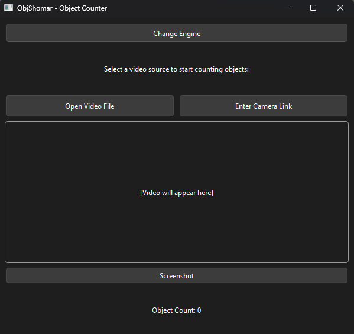
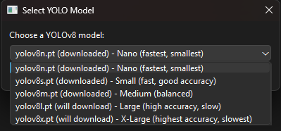
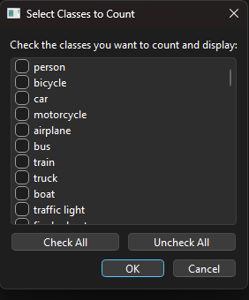
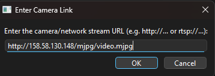
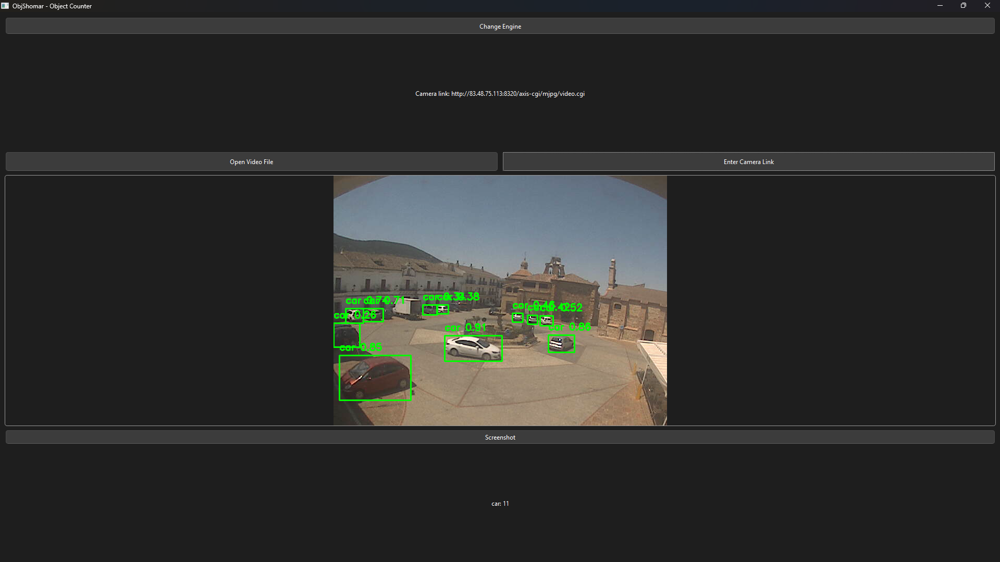
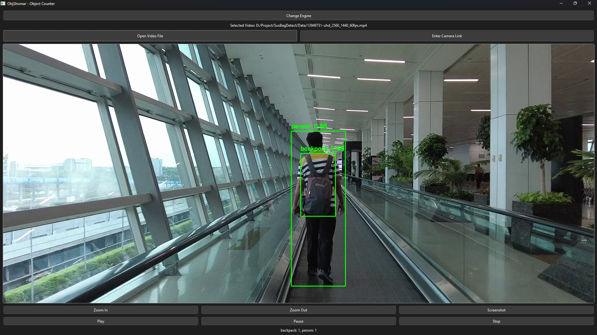

# ObjShomar 🎥📦🔢

[](./LICENSE)


---

## 📑 Navigation | ناوبری
- [🇬🇧 English](#english)
- [🇮🇷 فارسی](#persian)

---

<a name="english"></a>
# 🇬🇧 English

> **ObjShomar** — An application for object counting and detection in videos and camera streams using YOLOv8 and a modern, user-friendly desktop interface.
>
> **Name origin:** "ObjShomar" is a combination of "Object" (English) and "Shomar" (Persian for "counting").

---

## 🚀 Quick Start

1. **Clone the repository:**
   ```bash
   git clone https://github.com/YourUsername/ObjShomar.git
   cd ObjShomar
   ```
2. **Install Python 3.10+** (Recommended: 3.10, 3.11, or 3.12)
3. **Install dependencies:**
   ```bash
   pip install -r requirements.txt
   ```
4. **Run the app:**
   ```bash
   python main.py
   ```

---

## 🖼️ Screenshots

| Main Window (Initial) | Model Selection | Class Selection |
|-----------------------|----------------|-----------------|
|  |  |  |

| Camera Link Input | Detection on Camera Stream | Detection on Video File |
|------------------|---------------------------|------------------------|
|  |  |  |

---

## ✨ Features

- **YOLOv8 Object Detection:**  
  Detect and count objects in real-time using the latest YOLOv8 models.
- **Flexible Model Selection:**  
  Choose from multiple YOLOv8 variants (nano, small, medium, large, x-large). Download missing models automatically.
- **Class Filtering:**  
  Select which object classes to count and display.
- **Multiple Video Sources:**  
  - Open local video files (MP4, AVI, etc.)
  - Enter camera/network stream URLs (RTSP, HTTP, etc.)
- **Live Visualization:**  
  Bounding boxes, labels, and object counts overlaid on video.
- **Zoom & Pan:**  
  Inspect video frames in detail with interactive zoom and pan.
- **Screenshot:**  
  Save annotated frames as images.
- **Modern GUI:**  
  Built with PySide6 (Qt for Python) for a responsive, cross-platform experience.
- **Easy Setup:**  
  Automatic dependency checks and guided installation.

---

## ❓ What is ObjShomar?

ObjShomar is a desktop tool for object counting and detection in videos or live streams using the powerful YOLOv8 deep learning models. It’s designed for ease of use, flexibility, and real-time performance—ideal for research, surveillance, traffic analysis, and more.

---

## 🤖 Powered by YOLO

This project uses the amazing [Ultralytics YOLOv8](https://github.com/ultralytics/ultralytics) object detection models.  
A huge thank you to the Ultralytics team and the open-source community for making state-of-the-art vision accessible!

---

## 📝 License

MIT

---

## 🤝 Contributing

Contributions, issues, and feature requests are welcome!  
Feel free to open an issue or submit a pull request.

---

## 📬 Contact

For questions, suggestions, or collaboration, feel free to reach out:
- 💼 [GitHub](https://github.com/YourUsername)
- 📧 Email: your.email@example.com

---

## 🏷️ Keywords

<span style="display:inline-block;background:#f3f3f3;border-radius:6px;padding:3px 10px;margin:2px 2px;font-size:90%;">YOLO</span>
<span style="display:inline-block;background:#f3f3f3;border-radius:6px;padding:3px 10px;margin:2px 2px;font-size:90%;">Object Detection</span>
<span style="display:inline-block;background:#f3f3f3;border-radius:6px;padding:3px 10px;margin:2px 2px;font-size:90%;">PySide6</span>
<span style="display:inline-block;background:#f3f3f3;border-radius:6px;padding:3px 10px;margin:2px 2px;font-size:90%;">Qt for Python</span>
<span style="display:inline-block;background:#f3f3f3;border-radius:6px;padding:3px 10px;margin:2px 2px;font-size:90%;">Video Analysis</span>
<span style="display:inline-block;background:#f3f3f3;border-radius:6px;padding:3px 10px;margin:2px 2px;font-size:90%;">Real-time</span>
<span style="display:inline-block;background:#f3f3f3;border-radius:6px;padding:3px 10px;margin:2px 2px;font-size:90%;">Deep Learning</span>
<span style="display:inline-block;background:#f3f3f3;border-radius:6px;padding:3px 10px;margin:2px 2px;font-size:90%;">Computer Vision</span>
<span style="display:inline-block;background:#f3f3f3;border-radius:6px;padding:3px 10px;margin:2px 2px;font-size:90%;">Object Counting</span>

---

## 🙏 Thanks

Special thanks to [Ultralytics YOLO](https://github.com/ultralytics/ultralytics) and the open-source community!

---

<a name="persian"></a>
# 🇮🇷 فارسی

> **اُبجِ شمار** — برنامه‌ای برای شمارش و تشخیص اشیا در ویدیوها و استریم‌های دوربین با استفاده از YOLOv8 و رابط کاربری مدرن و ساده.
>
> **درباره نام:** اُبجِ شمار ترکیبی از واژه انگلیسی "Object" (شیء) و واژه فارسی "شمار" (شمارش) است.

---

## 🚀 شروع سریع

۱. **کلون کردن مخزن:**
   ```bash
   git clone https://github.com/YourUsername/ObjShomar.git
   cd ObjShomar
   ```
۲. **نصب پایتون ۳.۱۰ یا بالاتر (پیشنهادی: ۳.۱۰، ۳.۱۱ یا ۳.۱۲)**
۳. **نصب وابستگی‌ها:**
   ```bash
   pip install -r requirements.txt
   ```
۴. **اجرای برنامه:**
   ```bash
   python main.py
   ```

---

## 🖼️ اسکرین‌شات

| پنجره اصلی | انتخاب مدل YOLO | انتخاب کلاس‌ها |
|------------|-----------------|----------------|
|  |  |  |

| ورودی لینک دوربین | تشخیص خودرو در استریم | تشخیص افراد و کوله‌پشتی در ویدیو |
|-------------------|----------------------|-------------------------------|
|  |  |  |

---

## ✨ ویژگی‌ها

- **تشخیص و شمارش اشیا با YOLOv8:**  
  شمارش و تشخیص اشیا به صورت بلادرنگ با مدل‌های YOLOv8
- **انتخاب مدل دلخواه:**  
  انتخاب از بین مدل‌های مختلف YOLOv8 (nano, small, medium, large, x-large) و دانلود خودکار مدل‌های مورد نیاز
- **فیلتر کلاس‌ها:**  
  انتخاب کلاس‌های مورد نظر برای شمارش و نمایش
- **پشتیبانی از منابع ویدیویی مختلف:**  
  - باز کردن فایل‌های ویدیویی (MP4, AVI و ...)
  - وارد کردن لینک استریم دوربین (RTSP, HTTP و ...)
- **نمایش زنده:**  
  نمایش جعبه و برچسب و شمارش اشیا روی ویدیو
- **بزرگ‌نمایی و جابجایی تصویر:**  
  امکان بزرگ‌نمایی و جابجایی برای بررسی دقیق‌تر فریم‌ها
- **گرفتن اسکرین‌شات:**  
  ذخیره فریم‌های حاشیه‌نویسی شده به عنوان تصویر
- **رابط کاربری مدرن:**  
  ساخته شده با PySide6 (Qt for Python) برای تجربه کاربری سریع و مدرن
- **نصب آسان:**  
  بررسی خودکار وابستگی‌ها و نصب راهنما

---

## ❓ اُبجِ شمار چیست؟

اُبجِ شمار یک ابزار دسکتاپ برای شمارش و تشخیص اشیا در ویدیوها یا استریم‌های زنده با استفاده از مدل‌های قدرتمند YOLOv8 است. این برنامه برای سهولت استفاده، انعطاف‌پذیری و عملکرد بلادرنگ طراحی شده است—مناسب برای پژوهش، نظارت، تحلیل ترافیک و موارد دیگر.

---

## 🤖 قدرت‌گرفته از YOLO

این پروژه از مدل‌های قدرتمند [Ultralytics YOLOv8](https://github.com/ultralytics/ultralytics) استفاده می‌کند.  
از تیم Ultralytics و جامعه متن‌باز بابت در دسترس قرار دادن فناوری بینایی ماشین پیشرفته سپاسگزاریم!

---

## 📝 مجوز

MIT

---

## 🤝 مشارکت

پیشنهادات، گزارش باگ و درخواست ویژگی جدید خوش‌آمد است!  
می‌توانید issue باز کنید یا pull request ارسال نمایید.

---

## 📬 ارتباط

برای سوال، پیشنهاد یا همکاری:
- 💼 [GitHub](https://github.com/YourUsername)
- 📧 ایمیل: your.email@example.com

---

## 🏷️ کلیدواژه‌ها

<span style="display:inline-block;background:#f3f3f3;border-radius:6px;padding:3px 10px;margin:2px 2px;font-size:90%;">YOLO</span>
<span style="display:inline-block;background:#f3f3f3;border-radius:6px;padding:3px 10px;margin:2px 2px;font-size:90%;">تشخیص اشیا</span>
<span style="display:inline-block;background:#f3f3f3;border-radius:6px;padding:3px 10px;margin:2px 2px;font-size:90%;">PySide6</span>
<span style="display:inline-block;background:#f3f3f3;border-radius:6px;padding:3px 10px;margin:2px 2px;font-size:90%;">Qt for Python</span>
<span style="display:inline-block;background:#f3f3f3;border-radius:6px;padding:3px 10px;margin:2px 2px;font-size:90%;">تحلیل ویدیو</span>
<span style="display:inline-block;background:#f3f3f3;border-radius:6px;padding:3px 10px;margin:2px 2px;font-size:90%;">بلادرنگ</span>
<span style="display:inline-block;background:#f3f3f3;border-radius:6px;padding:3px 10px;margin:2px 2px;font-size:90%;">یادگیری عمیق</span>
<span style="display:inline-block;background:#f3f3f3;border-radius:6px;padding:3px 10px;margin:2px 2px;font-size:90%;">بینایی ماشین</span>
<span style="display:inline-block;background:#f3f3f3;border-radius:6px;padding:3px 10px;margin:2px 2px;font-size:90%;">شمارش اشیا</span>

---

## 🙏 تشکر

تشکر ویژه از [Ultralytics YOLO](https://github.com/ultralytics/ultralytics) و جامعه متن‌باز!
